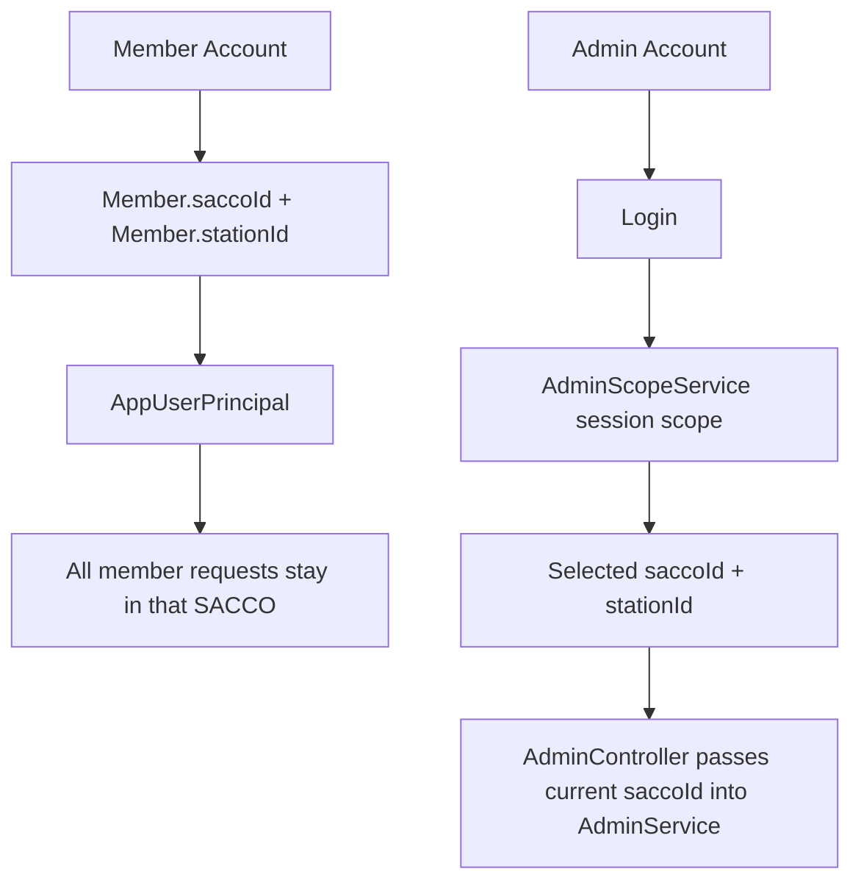
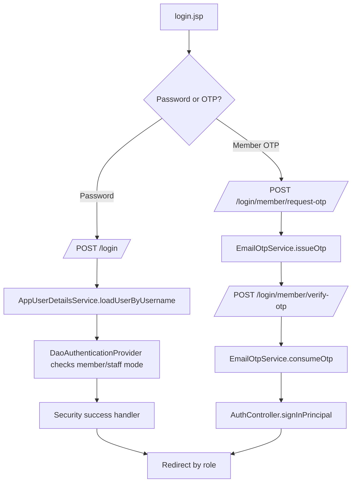
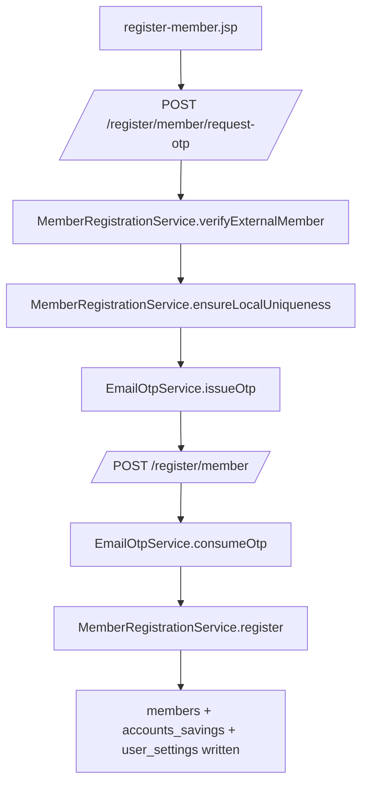
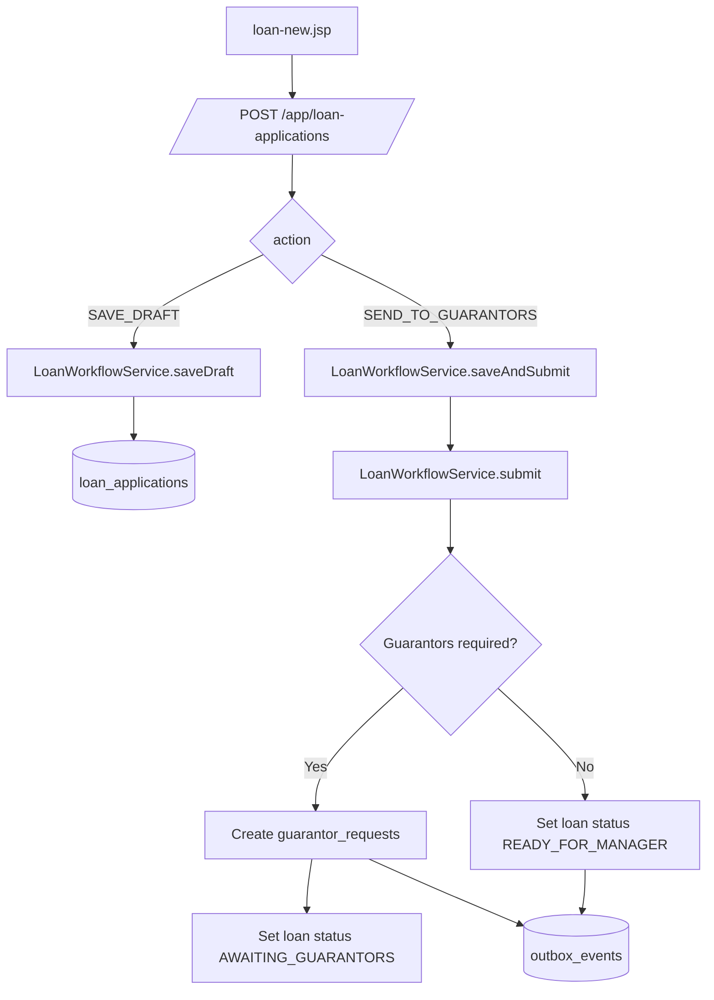
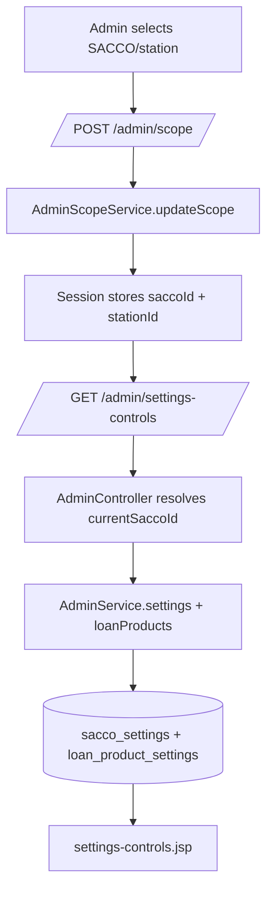
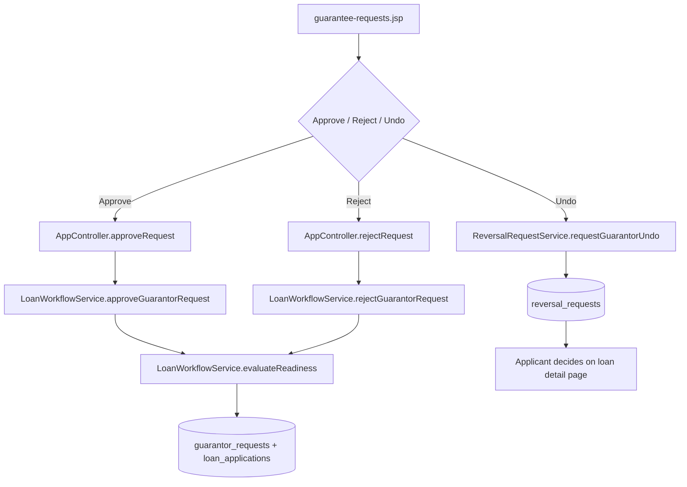

# Multi-SACCO Workflow Architecture Guide

Version: 1.0  
Last updated: 2026-04-17  
Repository: `SACCO Loan Workflow MVP`

This guide explains how the codebase is structured around the main business workflows and how multi-SACCO behavior is enforced across member, admin, manager, and board areas. The goal is to make onboarding and troubleshooting easier by following the actual request path used by the application:

`JSP page -> Spring MVC controller -> service -> repository -> JPA entity -> PostgreSQL`

---

## 1. Codebase Overview

### 1.1 Stack Summary

| Area | Technology |
| --- | --- |
| Backend runtime | Spring Boot 3.x |
| Language | Java |
| Web layer | Spring MVC |
| View layer | JSP + JSTL |
| Security | Spring Security, session-based form login |
| Persistence | Spring Data JPA + Hibernate |
| Database | PostgreSQL |
| Frontend styling | Tailwind CSS via CDN plus shared JSP shell fragments |

### 1.2 Request Flow Pattern

The dominant request pattern in this repository is:

1. A JSP page renders a form or action button.
2. The form submits to a Spring MVC endpoint.
3. The controller validates coarse request shape and principal ownership.
4. The service layer applies business rules and workflow transitions.
5. Repositories read and write JPA entities.
6. Hibernate persists the changes into PostgreSQL tables.
7. Redirects or reloaded pages show the updated state.

### 1.3 Role Partitioning

| Role | Main route area | Main controller | Main service | Primary concern |
| --- | --- | --- | --- | --- |
| Member | `/app/**` | `AppController` | `LoanWorkflowService` | Registration, login, loans, guarantor actions, support |
| Admin | `/admin/**` | `AdminController` | `AdminService` | SACCO-scoped administration, users, settings, incidents |
| Manager | `/manager/**` | `ManagerController` | `ManagerService` | Manager review, finalization, manager reports/settings |
| Board | `/board/**` | `BoardController` | `BoardService` | Board quorum review and decision aggregation |
| Chairperson | `/chairperson/**` | separate area | separate area | not covered deeply in this guide |

### 1.4 Multi-SACCO Model At A Glance

The app is multi-SACCO in an application-level tenancy model, not a separate-database-per-SACCO model.

- Members are bound to one `saccoId` and one `stationId`.
- Admins can switch their active SACCO and station workspace in session.
- Manager and board actions are constrained by the SACCO attached to the underlying loan or role assignment.



---

## 2. Multi-SACCO Architecture

### 2.1 Member Model: Fixed SACCO Identity

Member identity is SACCO-bound at registration time and then copied into the authenticated principal.

Primary files:

- `src/main/java/com/sacco/mvp/domain/Member.java`
- `src/main/java/com/sacco/mvp/security/AppUserPrincipal.java`
- `src/main/java/com/sacco/mvp/service/MemberRegistrationService.java`
- `src/main/java/com/sacco/mvp/web/AppController.java`

Key behavior:

- `MemberRegistrationService.register(...)` creates a `Member` with `saccoId` and `stationId`.
- `AppUserPrincipal` copies `member.getSaccoId()` and `member.getStationId()` into the logged-in principal.
- Member controllers then reuse `principal.getSaccoId()` and `principal.getStationId()` instead of asking the user to choose a workspace.

What this means in practice:

- A member cannot switch into another SACCO during the session.
- All member workflows use the SACCO recorded on the `Member` row.
- Cross-SACCO guarantor selection is blocked in the service layer.

### 2.2 Admin Model: Session-Selected Workspace

Admins log in once and then explicitly choose which SACCO and station they want to operate in.

Primary files:

- `src/main/java/com/sacco/mvp/service/AdminScopeService.java`
- `src/main/java/com/sacco/mvp/config/AdminScopeInterceptor.java`
- `src/main/java/com/sacco/mvp/web/AdminController.java`
- `src/main/java/com/sacco/mvp/web/CurrentUserModelAdvice.java`
- `src/main/webapp/WEB-INF/jsp/fragments/sidebar.jspf`

Key behavior:

- `AdminScopeService` stores the current admin SACCO and station in HTTP session keys.
- `AdminScopeInterceptor` redirects admins to `/admin/scope/select` if no explicit scope has been selected yet.
- `CurrentUserModelAdvice` exposes the resolved scope to the header/sidebar so the UI can display and switch it.
- `AdminController` reads the current scoped SACCO before calling `AdminService`.

### 2.3 Shared UI Exposure

`CurrentUserModelAdvice` is the bridge between backend identity/scope and the shared UI shell.

It publishes:

- current logged-in user summary
- header notifications
- `adminScope`
- `adminScopeOptionsJson`
- active SACCO name / logo text / logo URL

That is why the sidebar and header can stay consistent without each individual controller rebuilding all scope data.

### 2.4 End-to-End Comparison

#### Member example

1. `MEM007` logs in.
2. `AppUserPrincipal` contains:
   - `memberId = <uuid>`
   - `saccoId = "TAHA SACCOS"`
   - `stationId = "AR704"`
3. `AppController.createDraft(...)` calls `loanWorkflowService.saveDraft(principal.getSaccoId(), ...)`.
4. The resulting `loan_applications.sacco_id` becomes `TAHA SACCOS`.
5. Guarantor search is limited to the same SACCO.

#### Admin example

1. Admin logs in.
2. Spring Security redirects to `/admin/scope/select`.
3. The admin selects:
   - `saccoId = "TAHA SACCOS"`
   - `stationId = "AR704"`
4. `AdminScopeService.updateScope(...)` stores those values in session.
5. When the admin opens `/admin/users`, `AdminController.users(...)` calls:
   - `adminScopeService.currentSaccoId(principal)`
   - `adminService.usersPage(currentSaccoId, ...)`
6. Only rows for `TAHA SACCOS` are returned.

---

## 3. Workflow 1: Login Process

### Purpose

Authenticate members and staff, create a session-backed Spring Security context, and redirect the user to the role-appropriate workspace.

### Entry Page(s)

- `src/main/webapp/WEB-INF/jsp/login.jsp`

Main entry options:

- Member password login
- Member OTP login
- Staff password login
- Staff OTP login

### JSP Form / Action Summary

Primary form actions from `login.jsp`:

- Password forms submit to `/login`
- Member OTP request uses `/login/member/request-otp`
- Member OTP verification uses `/login/member/verify-otp`
- Staff OTP request uses `/login/staff/request-otp`
- Staff OTP verification uses `/login/staff/verify-otp`

Key submitted fields:

- Password login:
  - `username`
  - `password`
  - optional `loginType=staff-password` on the staff password form
- Member OTP:
  - `email`
  - `otpCode`
- Staff OTP:
  - `email`
  - `otpCode`

### Controller Path And Main Methods

Primary controller:

- `src/main/java/com/sacco/mvp/web/AuthController.java`

Important methods:

- `root(...)`
- `login(...)`
- `requestMemberLoginOtp(...)`
- `verifyMemberLoginOtp(...)`
- `requestStaffLoginOtp(...)`
- `verifyStaffLoginOtp(...)`

Security entry points:

- `src/main/java/com/sacco/mvp/config/SecurityConfig.java`
- `src/main/java/com/sacco/mvp/security/AppUserDetailsService.java`

### Service Stack Trace

| Layer | File / endpoint / method | Input received | Output / mutation | SACCO / station filter applied? | DB touchpoint |
| --- | --- | --- | --- | --- | --- |
| JSP | `login.jsp` password form | `username`, `password`, optional `loginType` | POST to `/login` | No | None |
| Security | `SecurityConfig.securityFilterChain()` form login | HTTP form data | delegates to authentication provider | Indirect, later through principal | None |
| Security | `AppUserDetailsService.loadUserByUsername(username)` | `username` | loads active account allowed for member/staff auth | No direct SACCO filter | `members` read via `MemberRepository.findByMemberNo(...)` |
| Security | `SecurityConfig.authenticationProvider(...)` | `AppUserPrincipal`, `loginType` | enforces member-vs-staff login mode | No | None |
| Security | `SecurityConfig.successHandler(...)` | authenticated principal | redirects to admin/manager/board/member destination | Admin scope reset on admin login | None |
| JSP/AJAX | `login.jsp` member OTP UI | `email`, `otpCode` | calls AuthController endpoints | No | None |
| Controller | `AuthController.requestMemberLoginOtp(...)` | email | issues login OTP | No | `members` read, `email_otp_tokens` write |
| Service | `EmailOtpService.issueOtp(...)` | email, purpose, memberId | stores OTP token and sends code | No | `email_otp_tokens` write |
| Controller | `AuthController.verifyMemberLoginOtp(...)` | email, otpCode | consumes OTP, signs in member | No | `email_otp_tokens` read/write, `members` read |
| Controller | `AuthController.signInPrincipal(...)` | `AppUserPrincipal` | writes Spring Security context into session | Principal now carries `saccoId` and `stationId` | Session write |

### Repository / Entity / DB Effects

Read path:

- `MemberRepository.findByMemberNo(...)`
- `MemberRepository.findByEmailIgnoreCase(...)`

Write path for OTP:

- `EmailOtpToken` rows in `email_otp_tokens`

Entities involved:

- `Member` -> `members`
- `EmailOtpToken` -> `email_otp_tokens`

No loan or SACCO business rows are changed during login itself. The key side effect is session authentication.

### Example Data Flow

#### Example A: Member password login

Input from JSP:

```text
POST /login
username=MEM007
password=Pass123!
```

Data movement:

1. `AppUserDetailsService.loadUserByUsername("MEM007")`
   - queries `members.member_no = 'MEM007'`
   - requires `status = ACTIVE`
   - requires either member access or staff roles
2. `AppUserPrincipal` is built from the `Member` row:
   - `memberId = 8c3...`
   - `saccoId = "TAHA SACCOS"`
   - `stationId = "AR704"`
   - roles/claims resolved from `UserClaimService`
3. `SecurityConfig.authenticationProvider(...)`
   - if this was a member password login, verifies the account is actually allowed as member access
4. `SecurityConfig.successHandler(...)`
   - if primary role is MEMBER, redirects to `/app/dashboard`

Final result:

- Spring Security session exists
- current user is authenticated as a member
- all future member actions inherit `TAHA SACCOS` and `AR704`

#### Example B: Member OTP login with a staff-only account

Input:

```text
POST /login/member/request-otp
email=admin@example.com
```

Behavior:

1. `AuthController.requestMemberLoginOtp(...)` finds the account by email.
2. If the account exists but `member.isMemberAccess()` is false, response is:

```json
{
  "valid": false,
  "message": "You are not registered as a member. Sign in through Staff instead."
}
```

That is how the code distinguishes "staff-only" from "no member record exists".

### State Transitions / Validations

Login does not change workflow state, but it does enforce:

- `MemberStatus.ACTIVE`
- member/staff access path separation
- OTP must be valid and consumable

### Multi-SACCO Enforcement Points

- Member SACCO and station come from `Member`, not from user-submitted login form fields.
- Admin login clears any previous admin scope and forces a new SACCO selection.

### Common Failure Modes

- Invalid password -> Spring form login failure handler sets `loginErrorMessage`
- Member tries member login with staff-only account -> "not registered as a member"
- Member email not found -> "Please register yourself first"
- Staff OTP for non-staff account -> "No active staff account matches that email address"
- Inactive account -> rejected before principal creation

### Variants

- `AuthController.root(...)` and `SecurityConfig.successHandler(...)` do not use identical manager redirects:
  - root route sends manager to `/manager/loan-applications?status=READY_FOR_MANAGER`
  - form-login success handler sends manager to `/manager/dashboard`
- Both are live code paths and worth knowing while debugging navigation.



---

## 4. Workflow 2: Registration Workflow

### Purpose

Create a new local member account after validating the person against registered SACCO/station data and an external member profile source.

### Entry Page(s)

- `src/main/webapp/WEB-INF/jsp/register-member.jsp`

### JSP Form / Action Summary

Key form actions:

- OTP request: `/register/member/request-otp`
- Final registration submit: `/register/member`

Key submitted fields:

- `memberNo`
- `fullName`
- `email`
- `phone`
- `nationalId`
- `saccoId`
- `stationId`
- `otpCode`

### Controller Path And Main Methods

Primary controller:

- `AuthController.registerMember(...)`
- `AuthController.requestMemberRegistrationOtp(...)`
- `AuthController.registerMemberSubmit(...)`

Primary service:

- `MemberRegistrationService.verifyExternalMember(...)`
- `MemberRegistrationService.ensureLocalUniqueness(...)`
- `MemberRegistrationService.register(...)`

### Service Stack Trace

| Layer | File / endpoint / method | Input received | Output / mutation | SACCO / station filter applied? | DB touchpoint |
| --- | --- | --- | --- | --- | --- |
| JSP | `register-member.jsp` | member form fields | POST to OTP or final submit endpoint | User chooses SACCO and station | None |
| Controller | `AuthController.requestMemberRegistrationOtp(...)` | validated form | verifies member and issues OTP | Yes, chosen `saccoId` and `stationId` go into verification | None directly |
| Service | `MemberRegistrationService.verifyExternalMember(...)` | full form | verifies external identity and selected SACCO/station | Yes | `registered_saccos`, `sacco_stations` read; external directory lookup |
| Service | `MemberRegistrationService.ensureLocalUniqueness(...)` | memberNo, email | blocks duplicates | No special SACCO filter | `members` read |
| Service | `EmailOtpService.issueOtp(...)` | email, purpose REGISTRATION | writes registration OTP | No | `email_otp_tokens` write |
| Controller | `AuthController.registerMemberSubmit(...)` | final form + otpCode | consumes OTP and calls register | SACCO/station already in form | `email_otp_tokens` read/write |
| Service | `MemberRegistrationService.register(...)` | full registration form | creates member and related local rows | Yes, persisted onto member/account/settings | `members`, `accounts_savings`, `user_settings`, `sacco_settings` write/read |

### Repository / Entity / DB Effects

Entities involved:

- `RegisteredSacco` -> `registered_saccos`
- `SaccoStation` -> station registry table
- `Member` -> `members`
- `SaccoSettings` -> `sacco_settings`
- `SavingsAccount` -> `accounts_savings`
- `UserSettings` -> `user_settings`
- `EmailOtpToken` -> `email_otp_tokens`

Important data effects:

- registration creates the local member record
- registration creates default local savings and user settings
- registration may create or update local `SaccoSettings` so the selected SACCO exists in app-local settings

### Example Data Flow

Input from JSP:

```text
memberNo=MEM007
fullName=Agnes Member
email=agnes@example.com
saccoId=TAHA SACCOS
stationId=AR704
otpCode=418266
```

Data movement:

1. `requestMemberRegistrationOtp(...)`
2. `MemberRegistrationService.verifyExternalMember(form)`
   - resolves `RegisteredSacco` using `TAHA SACCOS`
   - validates that station `AR704` belongs to that SACCO
   - fetches external profile by email/member reference
   - confirms the external profile matches the submitted member number and SACCO
3. `ensureLocalUniqueness("MEM007", "agnes@example.com")`
   - prevents duplicate local registration
4. `EmailOtpService.issueOtp(...)`
   - writes one registration OTP token
5. `registerMemberSubmit(...)`
   - consumes OTP
6. `MemberRegistrationService.register(form)`
   - writes `members.sacco_id = 'TAHA SACCOS'`
   - writes `members.station_id = 'AR704'`
   - creates `accounts_savings` row for that member
   - creates `user_settings` row for that member

Final DB-visible result:

- one new member bound permanently to the selected SACCO and station

### State Transitions / Validations

Registration validations:

- form bean validation via `@Valid`
- external member identity verification
- selected SACCO must exist in registered SACCO list
- selected station must belong to selected SACCO
- local uniqueness by member number and email
- OTP must be present and valid

### Multi-SACCO Enforcement Points

- SACCO membership becomes fixed here.
- The selected `saccoId` and `stationId` are written to the `Member` row.
- Everything later on the member side depends on those two fields.

### Common Failure Modes

- unknown SACCO or station
- external directory/profile mismatch
- duplicate member number or email
- missing/invalid OTP
- no local SACCO settings yet, causing the service to create/fill them



---

## 5. Workflow 3: Loan Application Workflow

### Purpose

Allow a member to create a draft, select guarantors, preview financials, submit to guarantors, and eventually move the application toward manager review.

### Entry Page(s)

- `src/main/webapp/WEB-INF/jsp/app/loan-new.jsp`
- `src/main/webapp/WEB-INF/jsp/app/loan-view.jsp`

Related endpoints also affect the same workflow:

- `/app/loan-applications`
- `/app/loan-applications/{id}`
- `/app/loan-applications/{id}/edit`
- `/app/loan-applications/{id}/submit`
- `/app/guarantors/search`
- `/app/loan-applications/financial-preview`

### JSP Form / Action Summary

Main form in `loan-new.jsp` posts to `/app/loan-applications`.

Key submitted fields:

- `loanType`
- `amount`
- `tenorMonths`
- optional `applicationId` for editing an existing draft
- `action`:
  - `SAVE_DRAFT`
  - `SEND_TO_GUARANTORS`
- `guarantorIds`
- `financialSnapshotJson`
- `topUpLoanId`
- dynamic schema/form fields from product-specific request params
- optional `attachments`
- optional `applicantSignatureOtpCode`

AJAX endpoints:

- `/app/loan-applications/financial-preview`
- `/app/loan-applications/external-eligibility-summary`
- `/app/loan-applications/request-signature-otp`
- `/app/loan-applications/verify-signature-otp`
- `/app/guarantors/search`

### Controller Path And Main Methods

Primary controller:

- `AppController.newApp(...)`
- `AppController.editDraft(...)`
- `AppController.createDraft(...)`
- `AppController.submit(...)`
- `AppController.searchGuarantors(...)`
- `AppController.financialPreview(...)`
- `AppController.externalEligibilitySummary(...)`

Primary service:

- `LoanWorkflowService.saveDraft(...)`
- `LoanWorkflowService.saveAndSubmit(...)`
- `LoanWorkflowService.submit(...)`
- `LoanWorkflowService.searchGuarantors(...)`
- `LoanWorkflowService.selectGuarantors(...)`
- `LoanWorkflowService.recordApplicantSignature(...)`

Supporting services:

- `FinancialDetailsService`
- `EligibilityService`
- `LoanPresentationService`
- `EmailOtpService`

### Service Stack Trace

| Layer | File / endpoint / method | Input received | Output / mutation | SACCO / station filter applied? | DB touchpoint |
| --- | --- | --- | --- | --- | --- |
| JSP | `loan-new.jsp` | loan fields, guarantor IDs, action | POST to `/app/loan-applications` | Not chosen by user; inherited from principal | None |
| Controller | `AppController.createDraft(...)` | request params + principal | branches to save draft or send to guarantors | Yes, uses `principal.getSaccoId()` | None directly |
| Service | `LoanWorkflowService.saveDraft(...)` | `saccoId`, `applicantId`, loan inputs | creates/updates `LoanApplication` draft | Yes | `loan_applications` write; related reads |
| Service | `LoanWorkflowService.validateGuarantorSelection(...)` | guarantor IDs | enforces count and same-SACCO guarantors | Yes | `members` read |
| Service | `FinancialDetailsService.generateSnapshot(...)` | saccoId, memberId, amount, tenor | generates fee/interest/principal snapshot | Yes | reads settings/accounts/loan products |
| Controller | `AppController.createDraft(...)` + action `SEND_TO_GUARANTORS` | existing draft + OTP if required | calls `saveAndSubmit(...)` | Yes | None directly |
| Service | `LoanWorkflowService.saveAndSubmit(...)` | draft inputs | saves draft then submits | Yes | `loan_applications`, `guarantor_requests`, `outbox_events` write |
| Service | `LoanWorkflowService.submit(...)` | `appId`, `memberId` | transitions to `AWAITING_GUARANTORS` or `READY_FOR_MANAGER` | Loan already has SACCO | `loan_applications`, `guarantor_requests`, `outbox_events` write |
| Controller | `AppController.submit(...)` | appId, OTP | direct submit of existing draft | Yes | None directly |

### Repository / Entity / DB Effects

Primary entities:

- `LoanApplication` -> `loan_applications`
- `GuarantorRequest` -> `guarantor_requests`
- `OutboxEvent` -> `outbox_events`
- `Member` -> `members`

Common reads:

- loan product settings
- member account/savings
- SACCO settings
- guarantor member records

Common writes:

- draft loan save/update
- selected guarantors JSON/list update
- guarantor request creation
- outbox events for downstream messaging/notifications

### Example Data Flow

Input from JSP:

```text
loanType=EDUCATION_LOAN
amount=100000
tenorMonths=3
applicationId=<existing draft uuid>
action=SEND_TO_GUARANTORS
guarantorIds=<uuid-a>&guarantorIds=<uuid-b>
financialSnapshotJson={"applicationFee":15000,"insuranceFee":1500,"interest":10000}
```

Assume principal:

```text
memberId = 2e4...
saccoId = TAHA SACCOS
stationId = AR704
```

Data movement:

1. `AppController.createDraft(...)` removes non-schema request fields and keeps product form payload.
2. Because `action = SEND_TO_GUARANTORS`, it calls `LoanWorkflowService.saveAndSubmit(...)`.
3. `saveAndSubmit(...)` first calls `saveDraft(...)`.
4. `saveDraft(...)`:
   - verifies the applicant does not already have another review-locked loan
   - validates tenor and schema fields
   - validates guarantor count and same-SACCO guarantor membership
   - persists `loan_applications.sacco_id = 'TAHA SACCOS'`
   - persists amount `100000`, tenor `3`, status `DRAFT`
5. `submit(...)` then decides:
   - if guarantors required: set `status = AWAITING_GUARANTORS`
   - else: set `status = READY_FOR_MANAGER`
6. For guarantor-required loans:
   - writes two `guarantor_requests` rows with `status = PENDING`
   - writes outbox events for guarantor assignment

Final DB-visible result:

- one loan row in `loan_applications`
- two rows in `guarantor_requests`
- one or more rows in `outbox_events`

### State Transitions / Validations

Primary statuses in this part of the workflow:

- `DRAFT`
- `AWAITING_GUARANTORS`
- `ALL_GUARANTORS_APPROVED`
- `READY_FOR_MANAGER`

Important validations:

- one in-progress loan lock for the applicant
- exact guarantor count required
- guarantors must belong to same SACCO
- applicant signature OTP may be required before immediate manager submission
- financial snapshot generated using SACCO-scoped rules

### Multi-SACCO Enforcement Points

- `principal.getSaccoId()` is passed into `saveDraft(...)`
- guarantor search uses `searchGuarantors(principal.getSaccoId(), ...)`
- guarantor validation rejects any guarantor outside the applicant's SACCO
- final persisted loan row carries `saccoId`

### Common Failure Modes

- trying to create another loan while an earlier one is still in review-locked statuses
- not enough guarantors selected
- selected guarantor belongs to another SACCO
- applicant signature missing when immediate manager submission needs OTP
- bad financial snapshot or schema validation failure



---

## 6. Workflow 4: Admin Settings Workflow

### Purpose

Allow an admin to modify SACCO-scoped loan product settings and board review rules after explicitly choosing the active SACCO workspace.

### Entry Page(s)

- `src/main/webapp/WEB-INF/jsp/admin/settings-controls.jsp`
- `src/main/webapp/WEB-INF/jsp/admin/scope-select.jsp`
- shared scope controls in `src/main/webapp/WEB-INF/jsp/fragments/sidebar.jspf`

### JSP Form / Action Summary

Scope selection:

- `/admin/scope` POST
- fields:
  - `saccoId`
  - `stationId`

Settings controls page:

- review rules form posts to `/admin/settings-controls/review-rules`
- per-product modal forms post to `/admin/settings-controls/{id}`

Key submitted fields:

- `boardQuorum`
- product settings such as:
  - `guarantorsRequired`
  - `maxLoanSavingsPercent`
  - `interestPercent`
  - other product-level fields depending on modal

### Controller Path And Main Methods

Primary controller:

- `AdminController.selectScope(...)`
- `AdminController.updateScope(...)`
- `AdminController.loanProducts(...)`
- `AdminController.updateLoanProduct(...)`
- `AdminController.updateReviewRules(...)`

Supporting infrastructure:

- `AdminScopeInterceptor.preHandle(...)`
- `AdminScopeService.currentScope(...)`

Primary service:

- `AdminService.loanProducts(...)`
- `AdminService.settings(...)`
- `AdminService.activeBoardMemberCount(...)`
- `AdminService.updateLoanProduct(...)`
- `AdminService.updateBoardReviewRequirement(...)`

### Service Stack Trace

| Layer | File / endpoint / method | Input received | Output / mutation | SACCO / station filter applied? | DB touchpoint |
| --- | --- | --- | --- | --- | --- |
| JSP | `scope-select.jsp` / sidebar scope form | `saccoId`, `stationId` | POST to `/admin/scope` | Yes, explicit user selection | None |
| Controller | `AdminController.updateScope(...)` | selected scope | stores admin workspace in session | Yes | None |
| Service | `AdminScopeService.updateScope(...)` | saccoId, stationId | writes session attributes | Yes | Session write |
| Controller | `AdminController.loanProducts(...)` | principal | loads settings for current scoped SACCO | Yes, `currentSaccoId(principal)` | None directly |
| Service | `AdminService.settings(...)` | saccoId | reads SACCO settings | Yes | `sacco_settings` read |
| Service | `AdminService.loanProducts(...)` | saccoId | reads scoped loan product settings | Yes | `loan_product_settings` read |
| Controller | `AdminController.updateReviewRules(...)` | `boardQuorum` | updates board reviewer rule | Yes | None directly |
| Service | `AdminService.updateBoardReviewRequirement(...)` | saccoId, adminId, boardQuorum | validates against active board count and updates settings | Yes | `sacco_settings`, `members` write/read |
| Controller | `AdminController.updateLoanProduct(...)` | product form fields | updates product settings | Yes | None directly |
| Service | `AdminService.updateLoanProduct(...)` | saccoId, adminId, productId, product fields | updates selected product row | Yes | `loan_product_settings` write |

### Repository / Entity / DB Effects

Primary entities:

- `SaccoSettings` -> `sacco_settings`
- `LoanProductSetting` -> `loan_product_settings`
- `Member` -> `members` for active board-member count

Important distinction:

- These settings are not global application flags.
- They apply to the SACCO currently selected in admin scope.

### Example Data Flow

Assume admin session scope:

```text
saccoId = TAHA SACCOS
stationId = AR704
```

Input from `settings-controls.jsp`:

```text
POST /admin/settings-controls/review-rules
boardQuorum=1
```

Data movement:

1. `AdminController.updateReviewRules(...)`
2. `adminScopeService.currentSaccoId(principal)` returns `TAHA SACCOS`
3. `AdminService.updateBoardReviewRequirement("TAHA SACCOS", adminId, 1)`
4. service checks:
   - value must be positive
   - `activeBoardMemberCount("TAHA SACCOS")` must be >= 1
5. `SaccoSettings` for `TAHA SACCOS` is updated:
   - `board_quorum = 1`

Final DB-visible result:

- only the `TAHA SACCOS` row in `sacco_settings` changes

### State Transitions / Validations

This workflow usually does not change loan workflow state immediately, but it changes future business rules used by manager and board workflows.

Important validations:

- admin must already have explicit scope selection
- station must belong to chosen SACCO
- board quorum must not exceed active board members in the same SACCO

### Multi-SACCO Enforcement Points

- `AdminScopeInterceptor` prevents ambiguous admin access before scope selection
- `AdminController` always resolves `currentSaccoId(principal)`
- service methods accept `saccoId` as an explicit parameter

### Common Failure Modes

- admin tries to save settings without a valid SACCO scope in session
- chosen station does not belong to selected SACCO
- board quorum greater than active board members
- product ID not belonging to the scoped SACCO



---

## 7. Workflow 5: Guarantee Request Workflow

### Purpose

Allow a guarantor to approve or reject a guarantor request, optionally request removal within the reversal window, and allow the applicant to decide that removal request.

### Entry Page(s)

- `src/main/webapp/WEB-INF/jsp/app/guarantee-requests.jsp`
- `src/main/webapp/WEB-INF/jsp/app/loan-view.jsp` for applicant-side reversal approval/rejection

### JSP Form / Action Summary

Key forms from `guarantee-requests.jsp`:

- approve: `/app/guarantee-requests/{requestId}/approve`
- reject: `/app/guarantee-requests/{requestId}/reject`
- undo/removal request: `/app/guarantee-requests/{requestId}/undo`

Supporting AJAX:

- `/app/guarantee-requests/request-signature-otp`

Applicant-side reversal decisions from loan view:

- `/app/loan-applications/{loanId}/guarantor-reversal-requests/{requestId}/approve`
- `/app/loan-applications/{loanId}/guarantor-reversal-requests/{requestId}/reject`

Key submitted fields:

- `guarantorDeclarationAccepted`
- `guarantorSignatureOtpCode`
- `requestId`
- applicant reversal decision uses path variables only

### Controller Path And Main Methods

Primary controller:

- `AppController.myGuarantorRequests(...)`
- `AppController.approveRequest(...)`
- `AppController.rejectRequest(...)`
- `AppController.undoGuarantorDecision(...)`
- `AppController.approveGuarantorUndoRequest(...)`
- `AppController.rejectGuarantorUndoRequest(...)`
- `AppController.requestGuarantorSignatureOtp(...)`

Primary services:

- `LoanWorkflowService.approveGuarantorRequest(...)`
- `LoanWorkflowService.rejectGuarantorRequest(...)`
- `LoanWorkflowService.removeGuarantorFromLoan(...)`
- `LoanWorkflowService.evaluateReadiness(...)`
- `ReversalRequestService.requestGuarantorUndo(...)`
- `ReversalRequestService.decideGuarantorUndo(...)`

### Service Stack Trace

| Layer | File / endpoint / method | Input received | Output / mutation | SACCO / station filter applied? | DB touchpoint |
| --- | --- | --- | --- | --- | --- |
| JSP | `guarantee-requests.jsp` approve form | requestId, declaration, OTP | POST approve endpoint | Not user-chosen; enforced through assignee checks | None |
| Controller | `AppController.approveRequest(...)` | requestId, declaration, OTP, principal | validates declaration and OTP | Guarantor ownership enforced by `@authz.isGuarantorAssignee(...)` | `members` read for signature/email |
| Service | `LoanWorkflowService.approveGuarantorRequest(...)` | requestId, guarantorId, signature | marks guarantor request approved | Loan's SACCO already persisted | `guarantor_requests`, `loan_applications` write |
| Service | `LoanWorkflowService.evaluateReadiness(...)` | loanApplicationId | may move loan to `ALL_GUARANTORS_APPROVED` | Loan SACCO already fixed | `guarantor_requests`, `loan_applications`, `outbox_events` |
| Controller | `AppController.rejectRequest(...)` | requestId | declines request | Guarantor ownership enforced | None directly |
| Service | `LoanWorkflowService.rejectGuarantorRequest(...)` | requestId, guarantorId, reason | marks request rejected and reevaluates loan | Same persisted SACCO | `guarantor_requests`, `loan_applications` write |
| Controller | `AppController.undoGuarantorDecision(...)` | requestId | asks applicant to remove guarantor | Same assignee enforcement | None directly |
| Service | `ReversalRequestService.requestGuarantorUndo(...)` | guarantorRequestId, guarantorMemberId | creates reversal request if within 24h | Uses loan's `saccoId` on reversal request | `reversal_requests`, `guarantor_requests`, `loan_applications`, `outbox_events` |
| Controller | `AppController.approveGuarantorUndoRequest(...)` | loanId, requestId | applicant approves removal | `@authz.isLoanOwner(...)` | None directly |
| Service | `ReversalRequestService.decideGuarantorUndo(...)` | reversalRequestId, applicantId, approve=true | removes guarantor from loan | Loan owner enforced | `reversal_requests`, `guarantor_requests`, `loan_applications`, `outbox_events` |

### Repository / Entity / DB Effects

Primary entities:

- `GuarantorRequest` -> `guarantor_requests`
- `LoanApplication` -> `loan_applications`
- `ReversalRequest` -> `reversal_requests`
- `OutboxEvent` -> `outbox_events`

Common write effects:

- guarantor request approval or rejection
- guarantor decision reversal request creation
- loan readiness recalculation after guarantor decisions
- outbox events for notifications/actions

### Example Data Flow

Input from guarantor page:

```text
POST /app/guarantee-requests/7ab.../approve
guarantorDeclarationAccepted=true
guarantorSignatureOtpCode=614228
```

Data movement:

1. `AppController.approveRequest(...)`
2. `requireMemberWithSavedSignature(...)` ensures guarantor has email + saved signature
3. `emailOtpService.validateOtp(...)` validates guarantor OTP
4. `loanWorkflowService.approveGuarantorRequest(requestId, guarantorId, signatureText, now)`
5. Service updates:
   - `guarantor_requests.status = APPROVED`
   - `guarantor_requests.signature_text = <saved signature>`
   - `guarantor_requests.decided_at = now`
6. `evaluateReadiness(loanId)` counts all guarantor decisions
7. If all required guarantors are approved:
   - `loan_applications.status = ALL_GUARANTORS_APPROVED`
   - outbox event `LOAN_GUARANTORS_APPROVED`

Later, if the same guarantor asks to be removed within 24 hours:

1. `ReversalRequestService.requestGuarantorUndo(...)`
2. writes `reversal_requests.type = GUARANTOR_DECISION_UNDO`
3. notifies the applicant through outbox
4. applicant decides from loan detail page

### State Transitions / Validations

Guarantor request statuses:

- `PENDING`
- `APPROVED`
- `REJECTED`
- `EXPIRED`

Loan statuses touched:

- `AWAITING_GUARANTORS`
- `ALL_GUARANTORS_APPROVED`
- may move back to earlier guarantor stage if a guarantor is removed

Important validations:

- guarantor must be the actual assignee
- guarantor must accept declaration before approval
- guarantor must have saved signature and valid OTP for approval
- removal request allowed only inside 24-hour reversal window
- applicant can approve/remove only while loan is still in guarantor stage

### Multi-SACCO Enforcement Points

- guarantor request belongs to a loan already stamped with one `saccoId`
- reversal requests copy `app.getSaccoId()` into `reversal_requests.sacco_id`
- applicant/guarantor ownership checks prevent cross-account actions

### Common Failure Modes

- guarantor tries to approve without declaration
- missing saved signature
- expired or invalid OTP
- removal request window already closed
- loan already moved past guarantor stage
- duplicate pending reversal request



---

## 8. Workflow 6: Manager Review Workflow

### Purpose

Allow managers to review applications that are ready for manager review, approve or reject them, assign board reviewers when approved, and later finalize the loan after board outcome.

### Entry Page(s)

- `src/main/webapp/WEB-INF/jsp/manager/queue.jsp`
- `src/main/webapp/WEB-INF/jsp/manager/detail.jsp`
- `src/main/webapp/WEB-INF/jsp/manager/dashboard.jsp`

### JSP Form / Action Summary

Key actions from `manager/detail.jsp`:

- decision form: `/manager/loan-applications/{id}/decision`
  - `decision=ACCEPT`
  - `decision=REJECT`
  - `reasons`
- finalization form: `/manager/loan-applications/{id}/finalize`
  - hidden `decision=FINAL_APPROVE`
  - hidden `decision=FINAL_REJECT`
- undo decision: `/manager/loan-applications/{id}/undo-decision`
- reversal request decisions:
  - `/manager/loan-applications/{loanId}/reversal-requests/{requestId}/approve`
  - `/manager/loan-applications/{loanId}/reversal-requests/{requestId}/reject`

### Controller Path And Main Methods

Primary controller:

- `ManagerController.queue(...)`
- `ManagerController.detail(...)`
- `ManagerController.decide(...)`
- `ManagerController.finalize(...)`
- `ManagerController.undoDecision(...)`
- `ManagerController.approveReversalRequest(...)`
- `ManagerController.rejectReversalRequest(...)`

Primary service:

- `ManagerService.queue(...)`
- `ManagerService.get(...)`
- `ManagerService.decide(...)`
- `ManagerService.finalizeDecision(...)`
- `ManagerService.undoDecision(...)`

### Service Stack Trace

| Layer | File / endpoint / method | Input received | Output / mutation | SACCO / station filter applied? | DB touchpoint |
| --- | --- | --- | --- | --- | --- |
| JSP | `manager/queue.jsp` | status filter | GET queue | Yes, manager sees only scoped SACCO data | None |
| Controller | `ManagerController.queue(...)` | principal, status | loads manager queue | Yes, `principal.getSaccoId()` | None directly |
| Service | `ManagerService.queue(...)` | saccoId, status | returns applications in manager view | Yes | `loan_applications` read |
| JSP | `manager/detail.jsp` decision form | `decision`, `reasons` | POST decision endpoint | Manager ownership via role + SACCO | None |
| Controller | `ManagerController.decide(...)` | loanId, decision, reasons | delegates to service | Yes | None directly |
| Service | `ManagerService.decide(...)` | loanId, managerId, decision, reasons | writes manager review and transitions loan | Yes, loan and manager must belong to same SACCO | `loan_applications`, `manager_reviews`, `board_reviews`, `outbox_events`, `members`, `sacco_settings` |
| Service | `RoleDirectoryService.activeByRole(...)` | saccoId, BOARD | returns active board pool | Yes | `members` read |
| Controller | `ManagerController.finalize(...)` | loanId, final decision | final approve/reject after board stage | Yes | None directly |
| Service | `ManagerService.finalizeDecision(...)` | loanId, managerId, final decision | moves loan to `FINAL_APPROVED` or `FINAL_REJECTED` | Yes | `loan_applications`, repayment/disbursement-related writes, `outbox_events` |

### Repository / Entity / DB Effects

Primary entities:

- `LoanApplication` -> `loan_applications`
- `ManagerReview` -> `manager_reviews`
- `BoardReview` -> `board_reviews`
- `SaccoSettings` -> `sacco_settings`
- `OutboxEvent` -> `outbox_events`

Important write effects on manager accept:

- create one `ManagerReview`
- update `loan_applications.status`
- clear stale board reviews if needed
- create fresh `BoardReview` assignments
- enqueue board assignment outbox events

### Example Data Flow

Assume:

```text
loanId = 85c6cbb5-...
managerId = Agnes Member UUID
saccoId = TAHA SACCOS
boardQuorum = 1
active board members in TAHA SACCOS = 1
```

Input from JSP:

```text
POST /manager/loan-applications/85c6cbb5.../decision
decision=ACCEPT
reasons=Applicant meets savings ratio and all guarantors approved.
```

Data movement:

1. `ManagerController.decide(...)`
2. `ManagerService.decide(loanId, managerId, ACCEPT, reasons)`
3. Service loads loan and checks:
   - current status must be `READY_FOR_MANAGER`
   - applicant has enough approved guarantors
   - acting member has active manager role in same SACCO
4. Service writes `manager_reviews` row:
   - decision `ACCEPT`
   - reasons text
5. Service reads `SaccoSettings` for `TAHA SACCOS`
   - required board reviewers = `boardQuorum = 1`
6. Service loads active board accounts in `TAHA SACCOS`
7. Service creates one `board_reviews` row with `decision = PENDING`
8. Service updates `loan_applications.status = AWAITING_BOARD`
9. Service writes outbox event `BOARD_REVIEW_ASSIGNED`

Final DB-visible result:

- loan leaves manager stage and enters board stage

### State Transitions / Validations

Manager-stage statuses:

- input status must be `READY_FOR_MANAGER`
- manager reject -> `MANAGER_REJECTED`
- manager accept -> `MANAGER_ACCEPTED` then immediately `AWAITING_BOARD`
- final approve after board approval -> `FINAL_APPROVED`
- final reject after board rejection -> `FINAL_REJECTED`

Important validations:

- enough approved guarantors before manager can accept
- enough active board members for the configured SACCO quorum
- acting user must have manager role in the same SACCO

### Multi-SACCO Enforcement Points

- manager queue is loaded by `principal.getSaccoId()`
- `ManagerService.get(...)` verifies the loan belongs to the manager's SACCO
- board reviewer selection uses `RoleDirectoryService.activeByRole(app.getSaccoId(), Position.BOARD)`

### Common Failure Modes

- manager tries to decide a loan not in `READY_FOR_MANAGER`
- not enough approved guarantors
- board quorum requires more active board members than available
- manager from SACCO A tries to open or act on SACCO B loan
- final approval attempted before board outcome exists

```mermaid
flowchart TD
    A[manager/queue.jsp] --> B[ManagerController.detail]
    B --> C[manager/detail.jsp]
    C --> D[/POST /manager/loan-applications/{id}/decision/]
    D --> E[ManagerService.decide]
    E --> F{ACCEPT or REJECT}
    F -->|REJECT| G[loan status MANAGER_REJECTED]
    F -->|ACCEPT| H[Load board quorum + active board members]
    H --> I[Create board_reviews]
    I --> J[loan status AWAITING_BOARD]
```

---

## 9. Workflow 7: Board Review Workflow

### Purpose

Allow assigned board members to review a loan, record approve/reject decisions, and aggregate those decisions into a board-level outcome using quorum rules.

### Entry Page(s)

- `src/main/webapp/WEB-INF/jsp/board/queue.jsp`
- `src/main/webapp/WEB-INF/jsp/board/detail.jsp`
- `src/main/webapp/WEB-INF/jsp/board/archive.jsp`

### JSP Form / Action Summary

Main board actions from `board/detail.jsp`:

- OTP request: `/board/loan-applications/{id}/request-signature-otp`
- decision form: `/board/loan-applications/{id}/decision`
  - `decision=APPROVED`
  - `decision=REJECTED`
  - `comment`
  - `boardSignatureOtpCode` for approval path

Undo route exists:

- `/board/loan-applications/{id}/undo`

but the service intentionally rejects reversal.

### Controller Path And Main Methods

Primary controller:

- `BoardController.queue(...)`
- `BoardController.archive(...)`
- `BoardController.detail(...)`
- `BoardController.requestBoardSignatureOtp(...)`
- `BoardController.decide(...)`
- `BoardController.undo(...)`

Primary service:

- `BoardService.assignedPending(...)`
- `BoardService.assignedAll(...)`
- `BoardService.getMyReview(...)`
- `BoardService.reviewsForLoan(...)`
- `BoardService.decide(...)`
- `BoardService.undoDecision(...)`

### Service Stack Trace

| Layer | File / endpoint / method | Input received | Output / mutation | SACCO / station filter applied? | DB touchpoint |
| --- | --- | --- | --- | --- | --- |
| JSP | `board/queue.jsp` | none or page navigation | loads assigned board work | Assigned reviews tied to board member | None |
| Controller | `BoardController.queue(...)` | principal | loads pending assignments | Yes, by board member identity | None directly |
| Service | `BoardService.assignedPending(...)` | boardMemberId | loads pending reviews | Indirect via assigned review rows | `board_reviews`, `loan_applications` read |
| JSP | `board/detail.jsp` | decision form fields | POST decision endpoint | `@authz.isBoardAssignee(...)` guards access | None |
| Controller | `BoardController.requestBoardSignatureOtp(...)` | loanId, principal | issues OTP if review still pending | Review belongs to board member | `members`, `loan_applications`, `board_reviews`, `email_otp_tokens` |
| Controller | `BoardController.decide(...)` | decision, comment, otp | validates OTP on approve path and delegates | Assigned reviewer only | None directly |
| Service | `BoardService.decide(...)` | loanId, boardMemberId, decision, comment | writes board review and reevaluates outcome | Loan already belongs to one SACCO | `board_reviews`, `loan_applications`, `sacco_settings`, `outbox_events` |
| Service | `BoardService.evaluateOutcome(...)` | `LoanApplication` | aggregates approvals/rejections against quorum | Uses loan's `saccoId` to load `SaccoSettings` | `board_reviews`, `loan_applications`, `sacco_settings`, `outbox_events` |

### Repository / Entity / DB Effects

Primary entities:

- `BoardReview` -> `board_reviews`
- `LoanApplication` -> `loan_applications`
- `SaccoSettings` -> `sacco_settings`
- `OutboxEvent` -> `outbox_events`
- `EmailOtpToken` -> `email_otp_tokens`

Important write effects:

- current board member's review row updated from `PENDING` to `APPROVED` or `REJECTED`
- once approvals or rejections reach quorum:
  - loan becomes `BOARD_APPROVED` or `BOARD_REJECTED`
  - outbox event is enqueued

### Example Data Flow

Assume:

```text
loanId = 85c6cbb5-...
boardMemberId = UUID of the only TAHA board user
boardQuorum = 1
```

Input from JSP:

```text
POST /board/loan-applications/85c6cbb5.../decision
decision=APPROVED
comment=All policy checks passed.
boardSignatureOtpCode=937144
```

Data movement:

1. `BoardController.decide(...)`
2. because decision is `APPROVED`, controller validates:
   - board member has saved signature
   - OTP is valid for `BOARD_SIGNATURE`
3. `BoardService.decide(loanId, boardMemberId, APPROVED, comment, signatureText, now)`
4. Service updates one row in `board_reviews`:
   - `decision = APPROVED`
   - `comment = All policy checks passed.`
   - `signature_text = <saved signature>`
   - `decided_at = now`
5. `evaluateOutcome(app)` counts approvals and rejections
6. Because `boardQuorum = 1` and approvals now equal 1:
   - `loan_applications.status = BOARD_APPROVED`
   - outbox event `BOARD_APPROVED`

Final DB-visible result:

- the board member's review row is no longer pending
- the loan is now board-approved and can be finalized by manager

### State Transitions / Validations

Review-row states:

- `PENDING`
- `APPROVED`
- `REJECTED`

Loan statuses touched:

- input status must be `AWAITING_BOARD`
- aggregated output becomes:
  - `BOARD_APPROVED`, or
  - `BOARD_REJECTED`

Important validations:

- current board member must actually be assigned to the loan
- review must still be `PENDING`
- approve path requires valid OTP and saved signature
- undo is intentionally disabled by service

### Multi-SACCO Enforcement Points

- board assignments were originally created from the loan's SACCO in manager workflow
- quorum lookup uses `SaccoSettings` for `app.getSaccoId()`
- board members only see reviews assigned to their own member ID

### Common Failure Modes

- non-assigned board user tries to open the detail page
- board member tries to decide a review already decided
- loan no longer in `AWAITING_BOARD`
- missing saved signature or bad OTP on approval
- undo attempted after board decision

```mermaid
flowchart TD
    A[board/queue.jsp] --> B[BoardController.detail]
    B --> C[board/detail.jsp]
    C --> D[/POST /board/loan-applications/{id}/decision/]
    D --> E[BoardService.decide]
    E --> F[Update current board_reviews row]
    F --> G[BoardService.evaluateOutcome]
    G --> H{Approvals or rejections reach quorum?}
    H -->|Yes approve| I[loan status BOARD_APPROVED]
    H -->|Yes reject| J[loan status BOARD_REJECTED]
    H -->|No| K[loan stays AWAITING_BOARD]
```

---

## 10. Appendix: Cross-Workflow Notes

### 10.1 Where SACCO Scoping Is Injected Most Often

Common injection points:

- `principal.getSaccoId()` on member routes
- `adminScopeService.currentSaccoId(principal)` on admin routes
- `app.getSaccoId()` on workflow transitions already attached to a loan

### 10.2 Main Persistence Tables By Workflow

| Workflow | Main tables touched |
| --- | --- |
| Login | `members`, `email_otp_tokens` |
| Registration | `registered_saccos`, station registry table, `members`, `accounts_savings`, `user_settings`, `sacco_settings`, `email_otp_tokens` |
| Loan application | `loan_applications`, `guarantor_requests`, `outbox_events`, `members`, `sacco_settings`, `loan_product_settings` |
| Admin settings | `sacco_settings`, `loan_product_settings`, `members` |
| Guarantee request | `guarantor_requests`, `loan_applications`, `reversal_requests`, `outbox_events`, `email_otp_tokens` |
| Manager review | `manager_reviews`, `loan_applications`, `board_reviews`, `outbox_events`, `sacco_settings`, `members` |
| Board review | `board_reviews`, `loan_applications`, `outbox_events`, `sacco_settings`, `email_otp_tokens` |

### 10.3 Mental Model For Reading The Code

When debugging any workflow in this project, the fastest reading order is:

1. open the JSP page that submits the action
2. find the controller endpoint handling that action
3. inspect the first service method called from that controller
4. inspect the entity/repository writes in that service
5. then inspect the secondary helper services only if the first service delegates

That order works well because the repository is structured mostly around controller-to-service orchestration rather than fat controllers or database triggers.

---

## 11. Suggested File Reading Order For New Developers

If you want to understand the system gradually, this reading order is the least overwhelming:

1. `src/main/java/com/sacco/mvp/config/SecurityConfig.java`
2. `src/main/java/com/sacco/mvp/security/AppUserPrincipal.java`
3. `src/main/java/com/sacco/mvp/web/AuthController.java`
4. `src/main/java/com/sacco/mvp/service/MemberRegistrationService.java`
5. `src/main/java/com/sacco/mvp/web/AppController.java`
6. `src/main/java/com/sacco/mvp/service/LoanWorkflowService.java`
7. `src/main/java/com/sacco/mvp/service/ReversalRequestService.java`
8. `src/main/java/com/sacco/mvp/service/AdminScopeService.java`
9. `src/main/java/com/sacco/mvp/web/AdminController.java`
10. `src/main/java/com/sacco/mvp/service/AdminService.java`
11. `src/main/java/com/sacco/mvp/web/ManagerController.java`
12. `src/main/java/com/sacco/mvp/service/ManagerService.java`
13. `src/main/java/com/sacco/mvp/web/BoardController.java`
14. `src/main/java/com/sacco/mvp/service/BoardService.java`

That reading order follows the user journey from authentication to workflows to scoped administration and final review layers.
