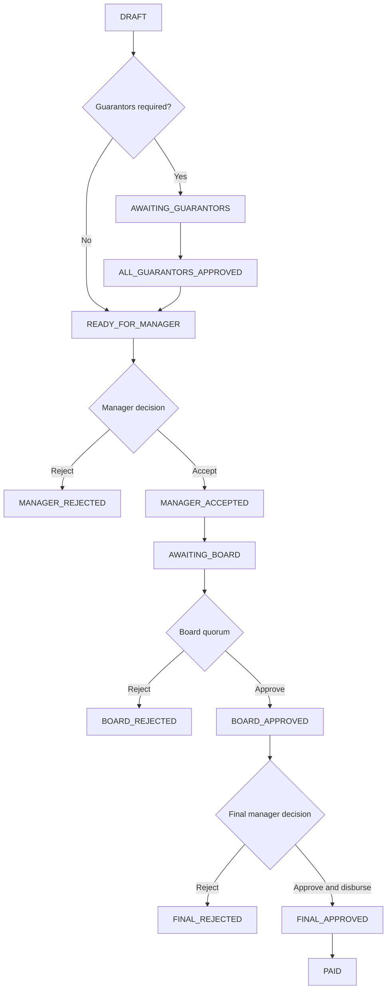

# Loan Application Status Flow

This document describes the official loan application statuses used in this system, the labels shown to users, and the normal workflow path.

## Source of truth

The official enum is defined in:

- [LoanStatus.java](C:/Users/USER/Desktop/IAA_SACCOS/src/main/java/com/sacco/mvp/domain/LoanStatus.java)

The user-facing English labels are defined in:

- [messages_en.properties](C:/Users/USER/Desktop/IAA_SACCOS/src/main/resources/messages_en.properties)

The main workflow transitions are handled in:

- [LoanWorkflowService.java](C:/Users/USER/Desktop/IAA_SACCOS/src/main/java/com/sacco/mvp/service/LoanWorkflowService.java)
- [ManagerService.java](C:/Users/USER/Desktop/IAA_SACCOS/src/main/java/com/sacco/mvp/service/ManagerService.java)
- [BoardService.java](C:/Users/USER/Desktop/IAA_SACCOS/src/main/java/com/sacco/mvp/service/BoardService.java)

## Official statuses

| Enum value | UI label |
| --- | --- |
| `DRAFT` | `DRAFT` |
| `SUBMITTED` | `SUBMITTED` |
| `AWAITING_GUARANTORS` | `AWAITING GUARANTORS` |
| `ALL_GUARANTORS_APPROVED` | `ALL GUARANTORS APPROVED` |
| `READY_FOR_MANAGER` | `ON REVIEW BY MANAGER` |
| `MANAGER_REJECTED` | `MANAGER REJECTED` |
| `MANAGER_ACCEPTED` | `MANAGER ACCEPTED` |
| `AWAITING_BOARD` | `ON REVIEW BY BOARD` |
| `BOARD_REJECTED` | `BOARD REJECTED` |
| `BOARD_APPROVED` | `REVIEWED` |
| `FINAL_REJECTED` | `FINAL REJECTED` |
| `FINAL_APPROVED` | `DISBURSED LOAN` |
| `PAID` | `PAID` |

## Plain-language meaning

| Status | Meaning |
| --- | --- |
| `DRAFT` | The member has started the application but has not sent it forward yet. |
| `SUBMITTED` | The application has been submitted internally as part of workflow progression. |
| `AWAITING_GUARANTORS` | The application is waiting for guarantors to respond. |
| `ALL_GUARANTORS_APPROVED` | All required guarantors have approved. |
| `READY_FOR_MANAGER` | The application is ready for manager review. |
| `MANAGER_REJECTED` | The manager rejected the application. |
| `MANAGER_ACCEPTED` | The manager accepted the application and moved it toward board review. |
| `AWAITING_BOARD` | The board is reviewing the application. |
| `BOARD_REJECTED` | The board rejected the application. |
| `BOARD_APPROVED` | The board approved the application. In the UI this is shown as `REVIEWED`. |
| `FINAL_REJECTED` | The final approval stage ended in rejection. |
| `FINAL_APPROVED` | The loan has been approved and disbursed. In the UI this is shown as `DISBURSED LOAN`. |
| `PAID` | The disbursed loan has been marked as fully returned. |

## Main workflow path

### Normal path with guarantors

1. `DRAFT`
2. `AWAITING_GUARANTORS`
3. `ALL_GUARANTORS_APPROVED`
4. `READY_FOR_MANAGER`
5. `MANAGER_ACCEPTED`
6. `AWAITING_BOARD`
7. `BOARD_APPROVED`
8. `FINAL_APPROVED`
9. `PAID`

### Normal path without guarantors

1. `DRAFT`
2. `READY_FOR_MANAGER`
3. `MANAGER_ACCEPTED`
4. `AWAITING_BOARD`
5. `BOARD_APPROVED`
6. `FINAL_APPROVED`
7. `PAID`

## Rejection paths

- Manager can reject from `READY_FOR_MANAGER` to `MANAGER_REJECTED`
- Board can reject from `AWAITING_BOARD` to `BOARD_REJECTED`
- Final stage can reject to `FINAL_REJECTED`

## Important workflow notes

- `READY_FOR_MANAGER` is the real internal status behind the UI label `ON REVIEW BY MANAGER`.
- `AWAITING_BOARD` is the real internal status behind the UI label `ON REVIEW BY BOARD`.
- `BOARD_APPROVED` is shown in the UI as `REVIEWED`.
- `FINAL_APPROVED` means the loan is already disbursed.
- `PAID` is separate from `FINAL_APPROVED`. The system now treats `PAID` as manager-confirmed repayment, not automatic repayment by timeout.

## Real transition behavior from the code

### Member / application workflow

- New application is created as `DRAFT`
- Sending to guarantors moves it to `AWAITING_GUARANTORS`
- If no guarantors are required, it can go directly to `READY_FOR_MANAGER`
- Once all guarantors approve, it becomes `ALL_GUARANTORS_APPROVED`
- Applicant submission after guarantor completion moves it to `READY_FOR_MANAGER`

### Manager workflow

- Manager review starts only from `READY_FOR_MANAGER`
- Manager reject sets `MANAGER_REJECTED`
- Manager accept first sets `MANAGER_ACCEPTED`
- Then the application is moved to `AWAITING_BOARD`
- After board approval, final manager approval sets `FINAL_APPROVED`
- Final rejection sets `FINAL_REJECTED`
- Manager can mark a disbursed loan as `PAID`
- Manager can also move a `PAID` loan back to `FINAL_APPROVED` if needed

### Board workflow

- Board review starts only from `AWAITING_BOARD`
- When board quorum approves, status becomes `BOARD_APPROVED`
- When board quorum rejects, status becomes `BOARD_REJECTED`
- Until quorum is reached, the application can remain in `AWAITING_BOARD`

## Visual flow

## Recommended user-facing explanation

If you need to explain the statuses to non-technical users, use this simpler wording:

- `Draft`
- `Waiting for Guarantors`
- `Ready for Manager Review`
- `Under Manager Review`
- `Under Board Review`
- `Reviewed`
- `Disbursed`
- `Paid`
- `Rejected`

These are easier to understand than exposing all internal workflow states directly.
